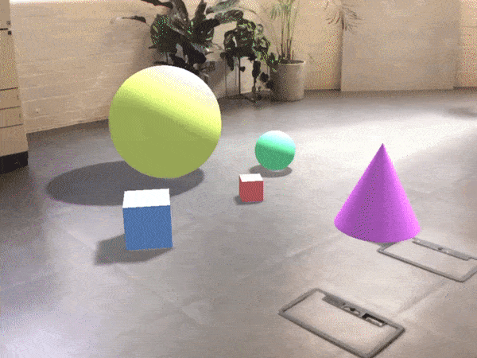

# ARKit Web

An experimetal iOS app for rapidly prototyping [ARKit](https://developer.apple.com/arkit/) experiences with WebGL.

  

## Features

* Metal rendering for Camera feed
* WebGL library free - use whatever graphics library you prefer
* Rapid prototyping using ngrok and Safari web inspector tools
* Simple JavaScript API for configuring ARKit and subscribing to events

## Example

```
import ARKit from './arkit/arkit';
import ARConfig from './arkit/config';

/* Turn on features */
ARConfig.imageFrame = true;
ARConfig.pointCloud = true;

/* Get latest frame data */
ARKit.on('frame', data => {});
```

## Requirements

* iOS11 (currently in beta and can be installed from [here](https://beta.apple.com/sp/betaprogram/))
* A device which has A9 and A10 processors

We recommend any of the following devices: iPad (2017), iPad Pro, iPhone 7 and 7 Plus.

## Implemented

* [ARPlaneAnchor](https://developer.apple.com/documentation/arkit/arplaneanchor)
* [ARAnchor](https://developer.apple.com/documentation/arkit/aranchor)
* [ARLightEstimate](https://developer.apple.com/documentation/arkit/arlightestimate)
* [ARHitTestResult](https://developer.apple.com/documentation/arkit/arhittestresult)
* [ARPointCloud rawFeaturePoints](https://developer.apple.com/documentation/arkit/arframe/2887449-rawfeaturepoints)
* [ARSession remove(anchor:)](https://developer.apple.com/documentation/arkit/arsession/2865607-remove)
* Camera feed as base64 to WebGL texture

## Getting started

This project is compromised of two parts:

1. A native iOS app that configures ARKit and exposes the frame data to a WKWebView layer.
2. A series of demos showing the features of ARKit and how to utilise the data with [threejs](https://threejs.org/).

### Installation

1. Open your terminal and navigate to the `arkit-web/Demos` directory
2. If you don't have `yarn` globally run `npm i yarn --global`
3. Install the project dependencies by running `yarn`

### Tasks

* `yarn start` - Start the dev server.
* `yarn tunnel` - Start an ngrok connection for live development

Check `Demos/package.json` for the other available tasks.

### Demos

Each demo contains instructions for setting up and running. 

* [Anchors](Demos/src/js/demos/index/README.md)
* [Shadows](Demos/src/js/demos/shadows/README.md)
* [Bubbles](Demos/src/js/demos/bubbles/README.md)
* [PointCloud](Demos/src/js/demos/pointcloud/README.md)

### Debugging

Use the [Safari Technology Preview](https://developer.apple.com/safari/technology-preview/) web inspector tools.


## Resources

* https://developer.apple.com/documentation/arkit
* [https://www.captechconsulting.com/blogs/arkit-fundamentals-in-ios-11](https://www.captechconsulting.com/blogs/arkit-fundamentals-in-ios-11)

## License

[MIT](LICENSE.md)
